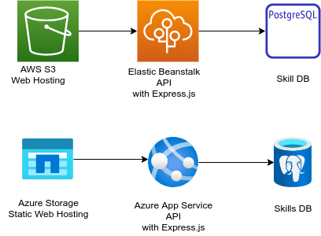

# My engineering web site overview

- [My engineering web site overview](#my-engineering-web-site-overview)
  - [Middleware with express.js and Backend DB](#middleware-with-expressjs-and-backend-db)
    - [Architecture](#architecture)
      - [API](#api)
        - [Database](#database)
      - [Experience](#experience)
        - [Model](#model)
        - [Funcions](#funcions)
        - [Endpoint API](#endpoint-api)
          - [GET /api/experience/list?tag=<tagid>](#get-apiexperiencelisttagtagid)
          - [GET /api/experience/:idx](#get-apiexperienceidx)
          - [POST /api/experience (token requied)](#post-apiexperience-token-requied)
          - [PUT /api/experience (token requied)](#put-apiexperience-token-requied)
          - [DELETE /experience/:id (token requied)](#delete-experienceid-token-requied)
      - [Tag](#tag)
        - [Model](#model-1)
        - [Model Functions](#model-functions)
        - [Endpoint API](#endpoint-api-1)
          - [GET /api/tag/list](#get-apitaglist)
          - [GET /api/tag/"tag name"](#get-apitagtag-name)
          - [POST /api/tag/"tag name" (token required)](#post-apitagtag-name-token-required)
          - [DELETE /api/tag/"tag name" (token required)](#delete-apitagtag-name-token-required)
        - [relexptag](#relexptag)
      - [Application User](#application-user)
        - [Model](#model-2)
        - [Endpoint API](#endpoint-api-2)
          - [/api/user/login](#apiuserlogin)
          - [GET /api/user/list [token required]](#get-apiuserlist-token-required)
          - [GET /api/user/:id](#get-apiuserid)
          - [POST /api/user [token required]](#post-apiuser-token-required)
          - [DELETE /api/user/:id [token required]](#delete-apiuserid-token-required)
      - [Deploy](#deploy)
        - [To AWS](#to-aws)
        - [To Azure](#to-azure)


## Middleware with express.js and Backend DB

### Architecture

#### API
##### Database


#### Experience

##### Model

```js
export type Experience = {
  id?: number, // -1 if not assigned in DB
  title: string,
  description: string,
  url?: string
};
```

##### Funcions
The functions created to exchange the model.

```js
list(idxTag?: number): Experience[]
get(idx: number): Experience
create(experience: Experience): Experience {}
update(experience: Experience): Experience {}
delete(id: number): Experience {}
```

- list(tagid?: number): Experience[]
  - list all the experiences
  - list all the experiences tagged with the

- get(idx: number): Experience

- create(experience: Experience): Experience {}

- update(experience: Experience): Experience {}

- delete(id: number): Experience {}


##### Endpoint API

###### GET /api/experience/list?tag=<tagid>

| code | result | When |
|-|-|-|
| 200 | Success | Found entry and responded |

Return list of experiences.
The tagid is optional to get the category tag of the experience.

The following is returned in the response.

```js
[
  {
    id: number
    title: string,
    description: string,
    url?: string
  },
  ...
]
```

###### GET /api/experience/:idx

Return an experience by index.

| code | result | When |
|-|-|-|
| 200 | Success | Found entry and responded |
| 404 | Not Found | The entry with the id is not found |

The following is returned in the response.
```js
{
  id: number,
  title: string,
  description: string,
  url?: string
};
```

###### POST /api/experience (token requied)

| code | result | When |
|-|-|-|
| 201 | Created | Successfully created |
| 401 | Unauthorized | token not acceptale |
| 406 | Not acceptale | failed in the request with bad format or data |
| 409 | Conflict | Already exists with the same title |

Create and experience.

Create an experience with the following formant.
If the title is duplicated, return an error resopnse (409).

- request body
```js
{
  id: number,
  title: string,
  description: string,
  url?: string
};
```

When correctly registered return code (201) returned with the created entry with an assigned id.
- response body
```js
{
  id: number,
  title: string,
  note: string,
  url?: string
};
```

###### PUT /api/experience (token requied)

| code | result | When |
|-|-|-|
| 200 | Created | Successfully update |
| 401 | Unauthorized | token not acceptable |
| 404 | Not Found | the experience entry is not found in DB |
| 406 | Not acceptale | failed in the request with bad format or data |

- request
```js
{
  id: number,
  title: string,
  description: string,
  url?: string
};
```

- response
```js
{
  id: number,
  title: string,
  description: string,
  url?: string
};
```

###### DELETE /experience/:id (token requied)

| code | result | When |
|-|-|-|
| 200 | OK | Successfully deleted |
| 400 | Bad request | token not accepted |
| 404 | Not Found | When there is no entry with the id |

```js
{
  id: number,
  title: string,
  description: string,
  url?: string
};
```


#### Tag

##### Model

```js
export type Tag = {
  id?: number, // -1 if not assigned in DB
  tag: string
};
```

##### Model Functions
```js
list(): Tag[]
get(idx: number): Tag
create(tag: string): Tag {}
delete(tag: string): Tag {}
```


##### Endpoint API

###### GET /api/tag/list

| code | result | When |
|-|-|-|
| 200 | Success | Found entry and responded |

###### GET /api/tag/"tag name"

| code | result | When |
|-|-|-|
| 200 | Success | Found entry and responded |
| 404 | Not Found | The entry with the tag name is not found |

###### POST /api/tag/"tag name" (token required)


| code | result | When |
|-|-|-|
| 201 | Created | Successfully created |
| 400 | Bad request | token not acceptale or no name specified |
| 409 | Conflict | Already exists with the same title |

###### DELETE /api/tag/"tag name" (token required)


| code | result | When |
|-|-|-|
| 200 | OK | Successfully deleted |
| 400 | Bad request | token not accepted |
| 404 | Not Found | When there is no entry with the tag name |


##### relexptag


#### Application User

##### Model

```js
export type User = {
  id: number, // -1 if not assigned in DB
  name: string,
  email: string,
  passwd: string,
};
```

```js
login()
async list(): Promise<User[]>\
async get(id: number): Promise<User>
async get(id: number): Promise<User>
async create(u: User): Promise<User>
async update(u: User): Promise<User>
async delete(id: number): Promise<User>
async authenticate(email: string, password: string): Promise<User | null>
```
##### Endpoint API

###### /api/user/login


For registered user, you can login by sending below in your request body.

```
{
    email: string;
    passwd: string;
}
```

In the response body, you get below. Extract the token from below and set as *Authorization: Bearer <token>*, where you find **[token required]**.

```
{
    email: string;
    token: string;
}
```

###### GET /api/user/list [token required]

| code | result | When |
|-|-|-|
| 200 | Success | Found entry and responded |
\
Get a list of users.

###### GET /api/user/:id

| code | result | When |
|-|-|-|
| 200 | Success | Found entry and responded |
| 404 | Not Found | The entry with the user id is not found |

###### POST /api/user [token required]


| code | result | When |
|-|-|-|
| 201 | Created | Successfully created |
| 401 | Unauthorized | token not acceptale or no name specified |
| 409 | Conflict | Already exists with the same user email |


Set the following in the request body.
```
{
    id: number,
    user: string,
    email: string,
    passwd: string
}
```

###### DELETE /api/user/:id [token required]

| code | result | When |
|-|-|-|
| 200 | OK | Successfully deleted |
| 401 | Unauthorized | token not accepted |
| 404 | Not Found | When there is no entry with the user id |


#### Deploy

Target environment.
Here I am going to try deploying to both AWS and Azure.



##### To AWS

https://docs.aws.amazon.com/ja_jp/elasticbeanstalk/latest/dg/using-features.managing.db.html


##### To Azure

https://docs.microsoft.com/ja-jp/azure/developer/python/how-to-create-static-sites

https://docs.microsoft.com/ja-jp/azure/postgresql/flexible-server/tutorial-webapp-server-vnet